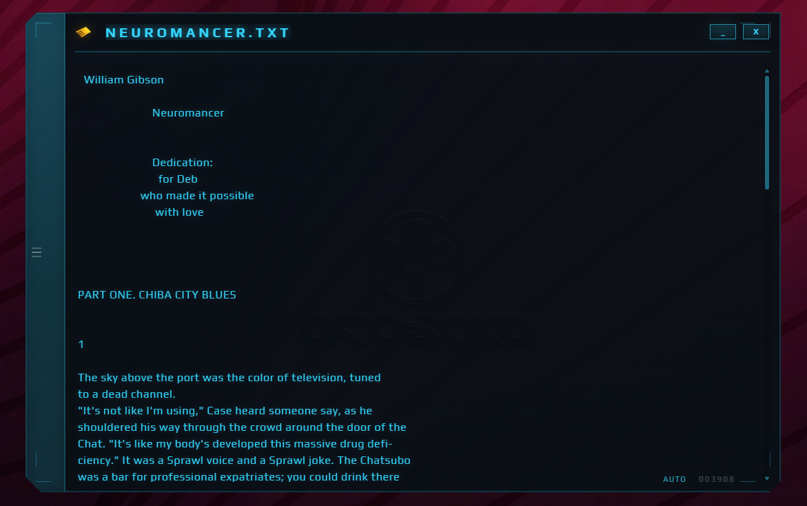

# CyberPad



Minimalist industrial notepad for people who prefer terminals over toys.

CyberPad is a lightweight, frameless, transparent **Tauri‑based
multi‑tab editor** written in Rust and Vanilla JavaScript, designed to
feel like a small system utility rather than a traditional application.

Fast launch. Zero clutter. Keyboard‑first. Persistent state. Native
performance.

Inspired by the **Memory Shards** interface from *Cyberpunk 2077* ---
small, floating, diegetic data panels that feel like hardware rather
than software.

------------------------------------------------------------------------

# ✦ What's New 0.1.4 --- Themes introduced

CyberPad now includes a possibility to switch between different themes.
There a few of them inspired by the original *Cyberpunk 2077* game. 
Build-in themes:
- Memory Shard (CyberPad default theme)
- Militech Record
- Arasaka Log
- Petrochem Purist (Light theme)

But mostly important you can do your own theme, using JSON files.
Visit: https://arasakacorp.github.io/CyberPad-Rust-Tauri/

Copy past color theme in the: Settings -> Themes -> Custom 
and save it.

------------------------------------------------------------------------

# ✦ Features

## Core

-   Frameless transparent HUD window
-   Native Rust backend (Tauri)
-   Instant startup
-   Extremely low memory footprint
-   Portable executable

## Tabs System

-   Unlimited tabs
-   Independent content per tab
-   Independent undo / redo history
-   Persistent tabs on restart
-   Dirty state tracking
-   Scratch tabs supported

## File Operations

-   Open file
-   Save
-   Save As
-   Drag & Drop
-   Recent files list
-   Persistent recent history

## History Engine

-   Per‑tab undo / redo stacks
-   No cross‑tab history corruption
-   Deterministic behavior
-   Proper undo isolation

## Autosave

-   Per‑tab autosave
-   Idle autosave
-   Autosave indicator

## HUD Interface

-   Cyberpunk Memory Shard UI
-   Header preview system
-   Layered title rendering
-   Slide‑out drawer
-   Character counter

------------------------------------------------------------------------

# ✦ Keyboard Shortcuts

## File

Open file\
`Ctrl + O`

Save\
`Ctrl + S`

Save As\
`Ctrl + Shift + S`

## Tabs

New tab\
`Ctrl + T`

Close tab\
`Double‑click tab`

Switch tab\
`Click tab`

Preview filename\
`Hover tab`

## Editing

Undo\
`Ctrl + Z`

Redo\
`Ctrl + Y`

------------------------------------------------------------------------

# ✦ Tech Stack

Frontend:

-   Vanilla JavaScript
-   Custom CSS HUD styling
-   Vite

Backend:

-   Rust
-   Tauri v2

------------------------------------------------------------------------

# ✦ Development

Install:

``` bash
npm install
```

Run dev:

``` bash
npm run tauri dev
```

Build:

``` bash
npm run tauri build
```

------------------------------------------------------------------------

# ✦ Acknowledgments

Many thanks for all attention to the project. Making this project it's 
it's something new for me, and all the opinions and activity is inspiring
me to keep working on it.

Special thanks to:
-   [Trensiel](https://github.com/trensiel) - testing and bug reports

And also CD PROJECT RED, for original idea, beautiful designs and inspiration.

------------------------------------------------------------------------

# ✦ License

MIT
